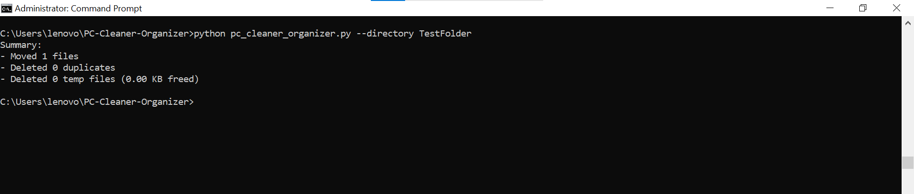
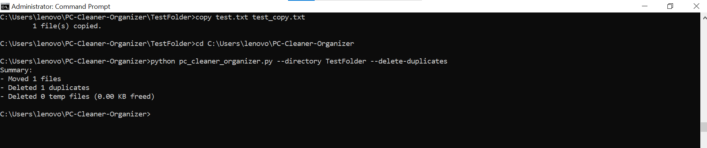
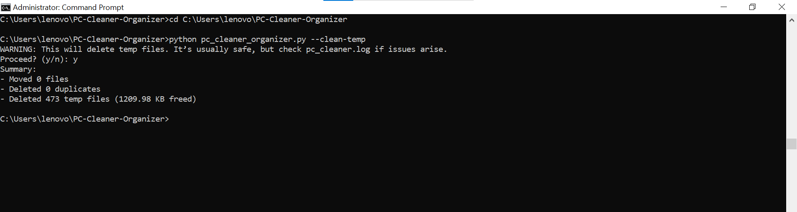

# PC Cleaner and Organizer

A Python script to automate PC cleaning and file organization. It organizes files into categories, deletes duplicates, and cleans temporary files to free up space.

## Features
- **File Organization**: Organizes files into categories (e.g., Documents, Images) based on file extensions.
- **Duplicate Detection**: Identifies and deletes duplicate files using file hashing.
- **Temp Cleanup**: Deletes temporary files from safe locations like `%temp%` to free up space.
- **Logging**: Logs all actions to `pc_cleaner.log` for safety and transparency.
- **Scheduling**: Supports scheduled runs (every 24 hours) using the `schedule` library.

## Requirements
- Python 3.x
- Required library: `schedule` (install with `pip install schedule`)

## Installation
1. Clone this repository:
## Screenshots
### File Organization
Organizes files like `test.txt` into `Documents`:

### Duplicate Detection
Deletes duplicates like `test_copy.txt`:

### Temp Cleanup
Frees up space by deleting temp files:

